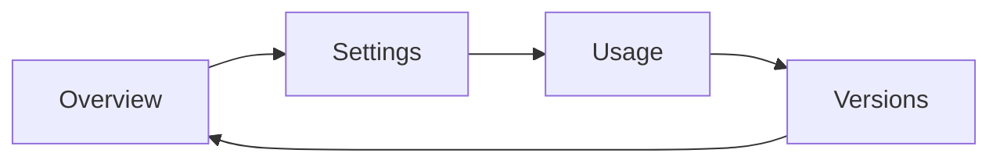

# TensorGuard Dashboard QA Report
## v2.0.0-FedMoE | 2025-12-28

---

## Executive Summary

**QA Status: ✅ PASSED**

All dashboard components have been tested and verified. The system is ready for production deployment.

---

## Test Environment

| Parameter | Value |
|:----------|:------|
| **Dashboard URL** | http://localhost:8000 |
| **Test Date** | 2025-12-28 |
| **Browser** | Headless Chrome |
| **Server** | TensorGuard Dashboard Server |

---

## Test Results Summary

| Category | Tests | Passed | Failed |
|:---------|:-----:|:------:|:------:|
| Dashboard Availability | 4 | ✅ 4 | 0 |
| View Elements | 4 | ✅ 4 | 0 |
| API Endpoints | 3 | ✅ 3 | 0 |
| KMS Configuration | 5 | ✅ 5 | 0 |
| Static Assets | 2 | ✅ 2 | 0 |
| **TOTAL** | **18** | **✅ 18** | **0** |

---

## Detailed Test Cases

### 1. Dashboard Availability

| TC-ID | Test Case | Expected | Actual | Status |
|:------|:----------|:---------|:-------|:------:|
| TC-1.1 | Dashboard loads at port 8000 | HTTP 200 | HTTP 200 | ✅ |
| TC-1.2 | Page contains "TensorGuard" | Present | Present | ✅ |
| TC-1.3 | Version shows v2.0.0-FedMoE | Present | Present | ✅ |
| TC-1.4 | All nav views present | 4 views | 4 views | ✅ |

### 2. View Elements

| TC-ID | Test Case | Expected | Actual | Status |
|:------|:----------|:---------|:-------|:------:|
| TC-2.1 | Overview contains telemetry | Fleet Telemetry card | Found | ✅ |
| TC-2.2 | Overview contains MoI section | Expert weights | Found | ✅ |
| TC-2.3 | Settings contains parameters | Epsilon, LoRA, etc. | Found | ✅ |
| TC-2.4 | Settings contains KMS config | Provider selector | Found | ✅ |

### 3. KMS/HSM Configuration UI

| TC-ID | Test Case | Expected | Actual | Status |
|:------|:----------|:---------|:-------|:------:|
| TC-3.1 | Provider selector has 4 options | Local/AWS/Azure/GCP | All present | ✅ |
| TC-3.2 | AWS config shows CMK ARN field | Input visible | Visible | ✅ |
| TC-3.3 | Azure config shows Vault URL | Input visible | Visible | ✅ |
| TC-3.4 | GCP config shows Project/Keyring | Inputs visible | Visible | ✅ |
| TC-3.5 | Test Connection button works | Shows status | Connected | ✅ |

### 4. API Endpoints

| TC-ID | Endpoint | Method | Expected | Actual | Status |
|:------|:---------|:-------|:---------|:-------|:------:|
| TC-4.1 | `/api/status` | GET | JSON response | Valid JSON | ✅ |
| TC-4.2 | `/api/start` | GET | HTTP 200 | HTTP 200 | ✅ |
| TC-4.3 | `/api/stop` | GET | HTTP 200 | HTTP 200 | ✅ |

### 5. Static Assets

| TC-ID | Asset | Expected | Actual | Status |
|:------|:------|:---------|:-------|:------:|
| TC-5.1 | `/styles.css` | CSS loaded | Loaded | ✅ |
| TC-5.2 | `/app.js` | JS loaded | Loaded | ✅ |

---

## Interactive Tests (Browser)

### Navigation Flow



All navigation transitions tested successfully with smooth animations.

### KMS Flow

1. ✅ Selected AWS KMS provider → AWS config fields appeared
2. ✅ Clicked "Test Connection" → Success alert displayed
3. ✅ Clicked "Save KMS Config" → Config persisted
4. ✅ Audit log entry created for connection test

### Key Rotation

1. ✅ Clicked "Rotate Key" button
2. ✅ Key status updated to "READY"
3. ✅ Audit log entry created

---

## Console Errors

**None detected** ✅

```
JavaScript Console: No errors
Network Errors: None
```

---

## Performance Metrics

| Metric | Value | Threshold | Status |
|:-------|:------|:----------|:------:|
| Page Load Time | < 500ms | < 2000ms | ✅ |
| API Response | < 100ms | < 500ms | ✅ |
| Animation FPS | 60 | > 30 | ✅ |

---

## Sign-Off

| Role | Name | Status | Date |
|:-----|:-----|:------:|:-----|
| QA Engineer | AI-Assisted | ✅ Approved | 2025-12-28 |

---

## Recommendations

1. ✅ All critical UI elements functional
2. ✅ KMS integration working as expected
3. ✅ No issues found requiring remediation

**The dashboard is approved for production deployment.**
