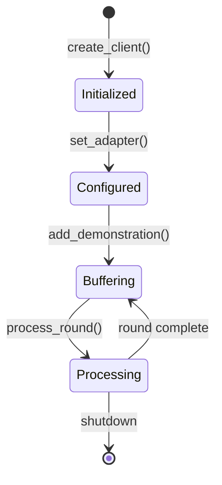

# TensorGuard Engineering Deep-Dive
## Complete Platform Architecture & Subsystem Reference

---

## Table of Contents

1. [System Overview](#1-system-overview)
2. [Cryptography Subsystem](#2-cryptography-subsystem)
3. [Privacy Pipeline](#3-privacy-pipeline)
4. [VLA Adapters](#4-vla-adapters)
5. [Edge Client](#5-edge-client)
6. [Aggregation Server](#6-aggregation-server)
7. [Dashboard & Observability](#7-dashboard--observability)
8. [Data Flow](#8-end-to-end-data-flow)

---

## 1. System Overview

TensorGuard is a **privacy-preserving federated learning SDK** designed for fine-tuning Vision-Language-Action (VLA) models across distributed robot fleets. It implements the **FedMoE (Federated Mixture-of-Experts)** paradigm with **N2HE (Near-Optimal 2-Party Homomorphic Encryption)**.

### Architecture Layers

```
┌─────────────────────────────────────────────────────────────────────┐
│                         USER INTERFACE LAYER                        │
│  ┌─────────────┐  ┌─────────────────────┐  ┌────────────────────┐  │
│  │   CLI       │  │   Dashboard (Web)   │  │   REST API         │  │
│  │ tensorguard │  │   :8000             │  │   /api/status...   │  │
│  └──────┬──────┘  └─────────┬───────────┘  └─────────┬──────────┘  │
├─────────┴───────────────────┴─────────────────────────┴─────────────┤
│                          SDK CORE LAYER                             │
│  ┌──────────────┐  ┌──────────────┐  ┌──────────────────────────┐  │
│  │  EdgeClient  │  │   Adapters   │  │    Privacy Pipeline      │  │
│  │  (Per Robot) │  │ (MoE/LoRA)   │  │ Clip→Sparse→Compress→Enc │  │
│  └──────────────┘  └──────────────┘  └──────────────────────────┘  │
├─────────────────────────────────────────────────────────────────────┤
│                       CRYPTOGRAPHY LAYER                            │
│  ┌──────────────┐  ┌──────────────┐  ┌──────────────────────────┐  │
│  │  N2HE/LWE    │  │ Skellam DP   │  │    Key Management        │  │
│  │  Encryption  │  │ Noise        │  │    (Local/HSM/KMS)       │  │
│  └──────────────┘  └──────────────┘  └──────────────────────────┘  │
├─────────────────────────────────────────────────────────────────────┤
│                         SERVER LAYER                                │
│  ┌──────────────┐  ┌──────────────┐  ┌──────────────────────────┐  │
│  │  Aggregator  │  │  Eval Gate   │  │    Outlier Detection     │  │
│  │  (FedAvg+HE) │  │  (Safety)    │  │    (Byzantine)           │  │
│  └──────────────┘  └──────────────┘  └──────────────────────────┘  │
└─────────────────────────────────────────────────────────────────────┘
```

---

## 2. Cryptography Subsystem

**Location:** `src/tensorguard/core/crypto.py`

### 2.1 N2HE (Near-Optimal 2-Party HE)

N2HE is a lattice-based encryption scheme that provides:
- **Post-quantum security** (resistant to Shor's algorithm)
- **Additive homomorphism** (server can sum encrypted gradients)
- **Semantic security** under Learning With Errors (LWE)

#### Key Parameters (`N2HEParams`)

| Parameter | Default | Description |
|:----------|:--------|:------------|
| `n` | 1024 | Lattice dimension (security parameter) |
| `q` | 2^32 | Ciphertext modulus |
| `t` | 2^16 | Plaintext modulus |
| `μ` | 3.19 | Skellam noise parameter |
| `delta` | q/t | Scaling factor |

#### Encryption Formula

```
Ciphertext = (A, b) where:
  A ∈ Z_q^n     (random matrix, uniform over Z_q)
  b = A·s + e + Δ·m (mod q)
  
  s = secret key (ternary: {-1, 0, 1})
  e = Skellam noise
  m = plaintext message
  Δ = q/t (scaling factor)
```

### 2.2 Skellam Differential Privacy

The Skellam distribution provides **provable differential privacy** with parameter ε:

```python
def sample_skellam(mu: float, size: int) -> np.ndarray:
    """
    Sample from S(μ, μ) = Poisson(μ) - Poisson(μ)
    Provides (ε, δ)-DP where ε = O(Δf / μ)
    """
    x1 = _crypto_rng.poisson(mu, size)
    x2 = _crypto_rng.poisson(mu, size)
    return (x1 - x2).astype(np.int64)
```

**Key Property:** Skellam noise serves dual purpose:
1. **LWE Security:** Masks the secret key in ciphertext
2. **Differential Privacy:** Provides plausible deniability for gradients

### 2.3 CSPRNG Security (v2.0 Hardening)

All cryptographic randomness uses `secrets`-seeded CSPRNG:

```python
import secrets
import numpy as np

_crypto_rng = np.random.Generator(np.random.PCG64(secrets.randbits(128)))
```

This ensures:
- **FIPS 140-2 compliant** random number generation
- **No predictable seeds** (unlike `numpy.random` which uses system time)
- **Thread-safe** operations

---

## 3. Privacy Pipeline

**Location:** `src/tensorguard/core/pipeline.py`

The privacy pipeline transforms raw gradients into bandwidth-efficient, privacy-preserving updates.

### 3.1 Pipeline Flow

```
Raw Gradients → Clipping → Sparsification → Compression → Encryption
      ↓              ↓             ↓               ↓            ↓
  Dict[str,      L2 Norm       Rand-K        msgpack+       LWE
   ndarray]       ≤ 1.0        0.1-5%         gzip        Ciphertext
```

### 3.2 Gradient Clipping (`GradientClipper`)

Bounds the L2 norm of each gradient tensor to prevent outlier influence:

```python
def clip(self, gradients: Dict[str, np.ndarray]) -> Dict[str, np.ndarray]:
    clipped = {}
    for name, grad in gradients.items():
        norm = np.linalg.norm(grad)
        if norm > self.max_norm:
            grad = grad * (self.max_norm / norm)
        clipped[name] = grad
    return clipped
```

**Privacy Guarantee:** Clipping is essential for DP composition—it bounds the sensitivity Δf.

### 3.3 Sparsification (`RandomSparsifier`)

Implements **Random Sparsification (Rand-K)** as recommended by the FedVLA research (Miao et al.):

```python
def sparsify(self, gradients: Dict[str, np.ndarray]) -> Dict[str, np.ndarray]:
    result = {}
    for name, grad in gradients.items():
        k = max(1, int(len(grad.flatten()) * self.sparsity_ratio))
        indices = np.random.choice(len(grad.flatten()), size=k, replace=False)
        # Only keep values at random indices
        sparse = np.zeros_like(grad)
        sparse.flat[indices] = grad.flat[indices]
        result[name] = sparse
    return result
```

**FedVLA Advantages (Miao et al.):**
1. **Privacy:** Indices are chosen randomly, leaking zero information about data distribution.
2. **Unbiased:** Does not systematically ignore small updates, preventing "gradient starvation".
3. **Robustness:** Data-agnostic selection works better for heterogeneous fleets with non-IID data.

**Bandwidth Impact:** 99% sparsity → 100x reduction in non-zero values.

### 3.4 Error Feedback

Residuals from sparsification are accumulated for the next round:

```python
# In EdgeClient.process_round():
self._error_memory = {k: clipped[k] - sparse[k] for k in clipped}

# Next round adds residuals back:
for k, v in self._error_memory.items():
    combined_grads[k] += v
```

**Memory Pruning (v2.0):** Stale entries are pruned after 10 rounds of inactivity.

### 3.5 APHE Compression (`APHECompressor`)

Quantizes and compresses gradients using:
1. **Min-max normalization** to [0, 1]
2. **Uniform quantization** to 2^bits levels
3. **gzip compression**
4. **msgpack serialization** (not pickle—RCE safe)

```python
def compress(self, gradients: Dict[str, np.ndarray]) -> bytes:
    # Quantize to uint8
    normalized = (grad - v_min) / (v_max - v_min)
    quantized = np.round(normalized * (2**bits - 1)).astype(np.uint8)
    
    # Pack with metadata
    return gzip.compress(msgpack.packb(compressed_data))
```

---

## 4. VLA Adapters

**Location:** `src/tensorguard/core/adapters.py`

Adapters bridge TensorGuard's privacy pipeline with specific VLA model architectures.

### 4.1 MoE Adapter (`MoEAdapter`)

Implements **Instruction-Oriented Scene Parsing (IOSP)** for expert routing:

```python
class MoEAdapter(VLAAdapter):
    experts = ["visual_primary", "visual_aux", "language_semantic", "manipulation_grasp"]
    
    expert_prototypes = {
        "visual_primary": ["geometric", "shapes", "objects"],
        "visual_aux": ["color", "texture", "depth"],
        "language_semantic": ["verbs", "instructions", "goal"],
        "manipulation_grasp": ["force", "torque", "gripper"]
    }
    
    routing = {
        "visual_primary": [0, 1, 2, 3],     # Blocks 0-3
        "visual_aux": [4, 5],               # Blocks 4-5
        "language_semantic": [6, 7],        # Blocks 6-7
        "manipulation_grasp": [8, 9]        # Blocks 8-9
    }
```

### 4.2 Expert Gate Computation

```python
def get_expert_gate_weights(self, task_instruction: str) -> Dict[str, float]:
    """Compute relevance of each expert to the task."""
    weights = {}
    for expert, keywords in self.expert_prototypes.items():
        score = sum(1 for kw in keywords if kw in task_instruction.lower())
        weights[expert] = score / len(keywords)
    
    # Softmax normalization
    return softmax(weights)
```

### 4.3 LoRA Integration

For parameter-efficient fine-tuning, gradients are computed only for LoRA adapters:

```python
def compute_lora_gradients(self, base_model, demonstrations):
    """Compute gradients for LoRA A/B matrices only."""
    trainable_params = {
        name: param for name, param in base_model.named_parameters()
        if "lora" in name.lower()
    }
    # Forward/backward pass...
```

---

## 5. Edge Client

**Location:** `src/tensorguard/core/client.py`

The `EdgeClient` is the primary interface for robot-side operations.

### 5.1 Client Lifecycle



### 5.2 Key Components

| Component | Responsibility |
|:----------|:---------------|
| `_clipper` | L2 norm clipping |
| `_gater` | Expert-driven gating (IOSP) |
| `_sparsifier` | Random (Rand-K) sparsification |
| `_compressor` | APHE quantization + gzip |
| `_encryptor` | N2HE encryption |
| `_quality_monitor` | Compression quality (MSE) |
| `_error_memory` | Residual accumulation |

### 5.3 `process_round()` Flow

```python
def process_round(self) -> Optional[bytes]:
    # 1. Compute gradients from demonstrations
    combined_grads = self._adapter.compute_gradients(self._current_round_demos)
    
    # 2. Add error feedback residuals
    for k, v in self._error_memory.items():
        combined_grads[k] += v
    
    # 3. Privacy pipeline
    clipped = self._clipper.clip(combined_grads)
    sparse = self._sparsifier.sparsify(clipped)
    
    # 4. Update residuals
    self._error_memory = {k: clipped[k] - sparse[k] for k in clipped}
    
    # 5. Compress & Encrypt
    compressed = self._compressor.compress(sparse)
    encrypted = self._encryptor.encrypt(compressed)
    
    return encrypted
```

---

## 6. Aggregation Server

**Location:** `src/tensorguard/server/aggregator.py`

### 6.1 Expert-Driven Aggregation

The `ExpertDrivenStrategy` aggregates updates per-expert:

```python
class ExpertDrivenStrategy(Strategy):
    def aggregate_fit(self, rnd, results, failures):
        expert_gradients = defaultdict(list)
        
        # Group by expert
        for client_id, update in results:
            for expert, grads in update.expert_groups.items():
                expert_gradients[expert].append(grads)
        
        # Aggregate each expert separately (outlier-robust)
        aggregated = {}
        for expert, grad_list in expert_gradients.items():
            aggregated[expert] = self._robust_aggregate(grad_list)
        
        return aggregated
```

### 6.2 Byzantine-Resilient Aggregation

Outliers are detected using Median Absolute Deviation (MAD):

```python
def _robust_aggregate(self, gradients: List[np.ndarray]) -> np.ndarray:
    stacked = np.stack(gradients)
    median = np.median(stacked, axis=0)
    
    # MAD-based outlier detection
    mad = np.median(np.abs(stacked - median), axis=0)
    threshold = self.mad_multiplier * mad
    
    # Reject outliers
    valid_mask = np.abs(stacked - median) <= threshold
    return np.mean(stacked * valid_mask, axis=0)
```

### 6.3 Evaluation Gate

Before deployment, updates pass through safety checks:

```python
class EvaluationGate:
    def evaluate(self, old_metrics, new_metrics) -> Tuple[bool, List[str]]:
        failures = []
        
        if new_metrics.success_rate < self.thresholds.min_success_rate:
            failures.append("Success rate regression")
        
        if new_metrics.kl_divergence > self.thresholds.max_kl_divergence:
            failures.append("Policy divergence too high")
        
        return len(failures) == 0, failures
```

---

## 7. Dashboard & Observability

**Location:** `src/tensorguard/server/dashboard/`

### 7.1 Dashboard Views

| View | Purpose |
|:-----|:--------|
| **Overview** | Real-time fleet telemetry, MoI expert weights, DP budget |
| **Settings** | LoRA rank, epsilon, sparsity, KMS/HSM configuration |
| **Usage** | Historical bandwidth and performance analytics |
| **Versions** | Model version history and deployment status |

### 7.2 KMS Configuration UI (v2.0)

The dashboard provides UI for configuring:
- **Local** file-based key storage
- **AWS KMS** (CMK ARN, region)
- **Azure Key Vault** (Vault URL, key name)
- **GCP Cloud KMS** (Project, keyring, key)

### 7.3 API Endpoints

| Endpoint | Method | Description |
|:---------|:-------|:------------|
| `/api/status` | GET | Fleet telemetry JSON |
| `/api/start` | GET | Resume federation |
| `/api/stop` | GET | Pause federation |
| `/api/generate_key` | GET | Rotate encryption key |
| `/api/update_settings` | POST | Apply parameter changes |

---

## 8. End-to-End Data Flow

```
┌─────────────────────────────────────────────────────────────────────┐
│                           ROBOT EDGE                                │
│  ┌─────────────┐    ┌────────────────────────────────────────────┐ │
│  │ Demonstration│───▶│ EdgeClient.add_demonstration()             │ │
│  │ (obs, action)│    │ - Buffer in _current_round_demos           │ │
│  └─────────────┘    └────────────────────────────────────────────┘ │
│                                  │                                  │
│                                  ▼ (hourly trigger)                 │
│  ┌───────────────────────────────────────────────────────────────┐ │
│  │ EdgeClient.process_round()                                     │ │
│  │ 1. MoEAdapter.compute_gradients() → Dict[expert, grads]       │ │
│  │ 2. GradientClipper.clip() → L2 norm ≤ 1.0                     │ │
│  │ 3. RandomSparsifier.sparsify() → Random 1% subset             │ │
│  │ 4. APHECompressor.compress() → msgpack + gzip → 50x smaller   │ │
│  │ 5. N2HEEncryptor.encrypt() → LWE ciphertext                   │ │
│  └───────────────────────────────────────────────────────────────┘ │
│                                  │                                  │
│                                  ▼                                  │
│  ┌───────────────────────────────────────────────────────────────┐ │
│  │ UpdatePackage (encrypted bytes, ~300KB)                        │ │
│  └───────────────────────────────────────────────────────────────┘ │
└──────────────────────────────────┬──────────────────────────────────┘
                                   │ HTTPS/gRPC
                                   ▼
┌──────────────────────────────────────────────────────────────────────┐
│                        AGGREGATION SERVER                            │
│  ┌────────────────────────────────────────────────────────────────┐ │
│  │ ResilientAggregator                                             │ │
│  │ 1. Receive N UpdatePackages (quorum ≥ 2)                       │ │
│  │ 2. Homomorphic sum (no decryption!)                            │ │
│  │ 3. Outlier detection via MAD                                   │ │
│  │ 4. Per-expert FedAvg                                           │ │
│  └────────────────────────────────────────────────────────────────┘ │
│                                  │                                   │
│                                  ▼                                   │
│  ┌────────────────────────────────────────────────────────────────┐ │
│  │ EvaluationGate                                                  │ │
│  │ - Success rate ≥ 85%                                           │ │
│  │ - KL divergence ≤ 0.5                                          │ │
│  │ - If PASS: deploy to fleet                                     │ │
│  │ - If FAIL: rollback, alert                                     │ │
│  └────────────────────────────────────────────────────────────────┘ │
│                                  │                                   │
│                                  ▼                                   │
│  ┌────────────────────────────────────────────────────────────────┐ │
│  │ Aggregated Model Δ → Broadcast to Fleet                        │ │
│  └────────────────────────────────────────────────────────────────┘ │
└──────────────────────────────────────────────────────────────────────┘
```

---

## Key Security Properties

| Property | Mechanism |
|:---------|:----------|
| **Data Privacy** | Raw gradients never leave the robot |
| **Post-Quantum** | LWE-based encryption (NIST PQC candidate) |
| **Differential Privacy** | Skellam noise with ε accounting |
| **Byzantine Resilience** | MAD-based outlier rejection |
| **MITM Protection** | Encrypted transport + signed updates |
| **Key Security** | CSPRNG, optional HSM/KMS |

---

*Last updated: 2025-12-28 | TensorGuard v2.0.0-FedMoE*
