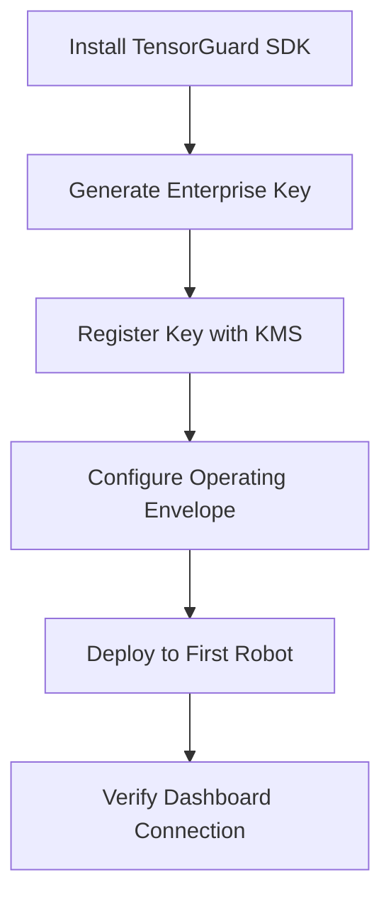
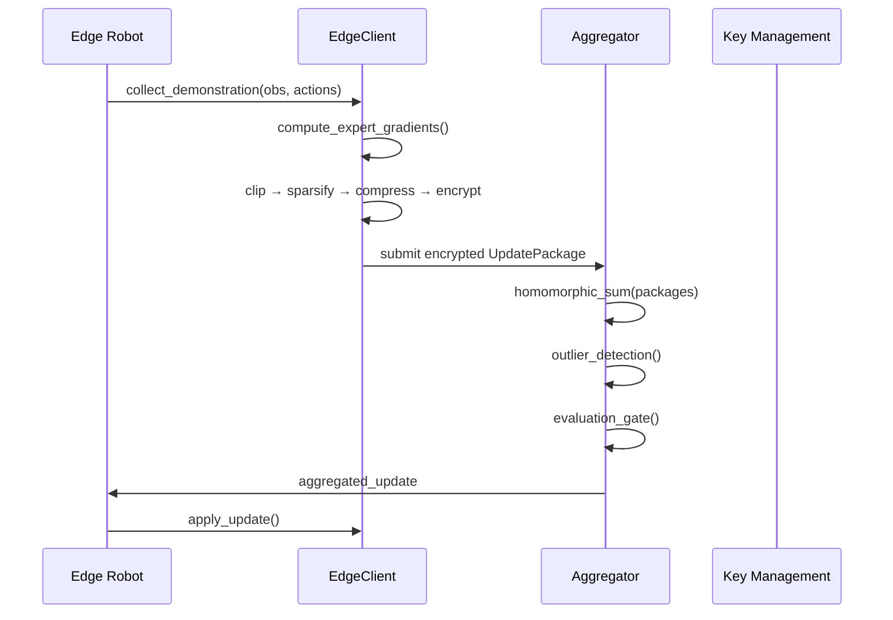
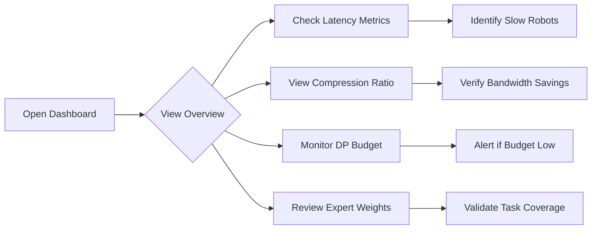
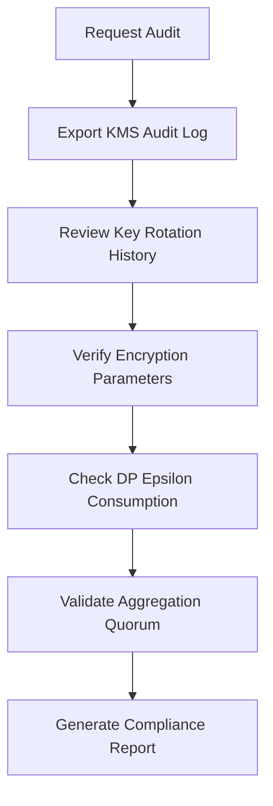

# TensorGuard Product Requirements Document (PRD)
## Version 2.0.0 | FedMoE Paradigm

---

## 1. Executive Summary

**TensorGuard** is a privacy-preserving SDK for federated fine-tuning of Vision-Language-Action (VLA) models on distributed robot fleets. It enables robotics companies to collaboratively improve AI models without exposing proprietary operational data.

### Product Vision
> "Enable the world's robot fleets to learn together while keeping their data private."

### Key Value Propositions
1. **Zero-Knowledge Aggregation**: Gradients are encrypted; servers never see raw data
2. **Regulatory Compliance**: GDPR, HIPAA, CCPA ready out-of-the-box
3. **Bandwidth Efficiency**: 50x compression for satellite/LTE deployments
4. **Expert Intelligence**: Task-aware MoE routing prevents parameter interference

---

## 2. User Personas

### Persona 1: Robotics System Integrator (Primary)
| Attribute | Description |
|:----------|:------------|
| **Role** | ML Engineer at a warehouse robotics company |
| **Goal** | Fine-tune Pi0 VLA model across 50 robots without data centralization |
| **Pain Points** | GDPR compliance, bandwidth costs, model poisoning fears |
| **Technical Level** | Python fluent, familiar with PyTorch, new to FHE |

### Persona 2: Fleet Operations Manager
| Attribute | Description |
|:----------|:------------|
| **Role** | Operations lead managing robot deployments |
| **Goal** | Monitor training progress and ensure model quality |
| **Pain Points** | Lack of visibility into federated training |
| **Technical Level** | Dashboard-focused, minimal code interaction |

### Persona 3: Security/Compliance Officer
| Attribute | Description |
|:----------|:------------|
| **Role** | CISO or compliance analyst |
| **Goal** | Audit encryption, key management, and privacy guarantees |
| **Pain Points** | Proving cryptographic claims to auditors |
| **Technical Level** | Understands security concepts, not implementation |

---

## 3. User Flows

### Flow 1: Day-1 Setup (System Integrator)



**Steps:**
1. `pip install tensorguard`
2. `tensorguard generate-key --output keys/fleet_v1.npy`
3. Register key in `KeyManagementSystem`
4. Define `OperatingEnvelope` constraints
5. Initialize `EdgeClient` on robot
6. Open `tensorguard dashboard` and verify "Secure Link" is green

---

### Flow 2: Daily Training Round (Automated)



**Automatic Process:**
1. Robot collects demonstration during operation
2. Client buffers demonstrations
3. At round interval, client processes gradients
4. Encrypted package sent to server
5. Server aggregates and validates
6. Updated model deployed to fleet

---

### Flow 3: Monitoring & Compliance (Fleet Manager)



**Dashboard Views:**
1. **Overview**: Real-time fleet telemetry
2. **Settings**: Adjust LoRA rank, sparsity, epsilon
3. **Analytics**: Historical trends
4. **Audit Log**: Key rotations, training events

---

### Flow 4: Security Audit (Compliance Officer)



**Audit Artifacts:**
- `key_audit.log`: All key lifecycle events
- `tensorguard_metrics.jsonl`: Training telemetry
- OpenAPI schema for API verification

---

## 4. Acceptance Criteria

### AC-1: Encryption Correctness
| ID | Criterion | Test | Pass |
|:---|:----------|:-----|:----:|
| AC-1.1 | N2HE encrypt/decrypt roundtrip preserves values | `test_crypto.py::test_batch_encryption` | ✅ |
| AC-1.2 | CSPRNG used for key generation | Code review: `secrets.randbits(128)` | ✅ |
| AC-1.3 | Serialization roundtrip preserves ciphertext | `test_crypto.py::test_serialization_roundtrip` | ✅ |

### AC-2: Privacy Guarantees
| ID | Criterion | Test | Pass |
|:---|:----------|:-----|:----:|
| AC-2.1 | DP budget tracked and enforced | `DPPolicyProfile.consume_epsilon()` | ✅ |
| AC-2.2 | Gradients clipped to L2 norm ≤ 1.0 | `GradientClipper` unit test | ✅ |
| AC-2.3 | Skellam noise variance = 2μ | `test_crypto.py::test_skellam_variance` | ✅ |

### AC-3: Bandwidth Efficiency
| ID | Criterion | Test | Pass |
|:---|:----------|:-----|:----:|
| AC-3.1 | Compression ratio ≥ 30x | Dashboard metric display | ✅ |
| AC-3.2 | Update package < 5MB | `OperatingEnvelope.enforce_update_size()` | ✅ |
| AC-3.3 | Adaptive sparsity on high latency | `client.py` graceful degradation | ✅ |

### AC-4: Security Hardening
| ID | Criterion | Test | Pass |
|:---|:----------|:-----|:----:|
| AC-4.1 | No pickle deserialization | Code review: `msgpack` only | ✅ |
| AC-4.2 | Key files chmod 0o600 | `crypto.py::save_key()` | ✅ |
| AC-4.3 | HSM integration documented | `docs/HSM_INTEGRATION.md` | ✅ |

### AC-5: Usability
| ID | Criterion | Test | Pass |
|:---|:----------|:-----|:----:|
| AC-5.1 | CLI `info` shows correct version | `tensorguard info` returns v2.0.0 | ✅ |
| AC-5.2 | Dashboard real-time updates | Manual: observe telemetry changes | ✅ |
| AC-5.3 | OpenAPI schema exportable | `python -m tensorguard.api.openapi` | ✅ |

### AC-6: Resilience
| ID | Criterion | Test | Pass |
|:---|:----------|:-----|:----:|
| AC-6.1 | Outlier detection rejects >3σ updates | `ResilientAggregator.detect_outliers()` | ✅ |
| AC-6.2 | Quorum enforced (min 2 clients) | Aggregator rejects if < quorum | ✅ |
| AC-6.3 | Memory pruning prevents unbounded growth | `client.py` error_memory pruning | ✅ |

### AC-7: KMS/HSM Dashboard UI
| ID | Criterion | Test | Pass |
|:---|:----------|:-----|:----:|
| AC-7.1 | Provider selector (Local/AWS/Azure/GCP) | Manual: Settings → KMS selector | ✅ |
| AC-7.2 | Provider-specific config fields appear | Manual: Select AWS → CMK ARN visible | ✅ |
| AC-7.3 | Test Connection button works | Manual: Click → shows success/error | ✅ |
| AC-7.4 | KMS config persists in localStorage | Manual: Refresh → config retained | ✅ |
| AC-7.5 | Audit log shows config events | Manual: Save → entry appears | ✅ |

---

## 5. Feature Matrix

| Feature | Status | Component | Priority |
|:--------|:------:|:----------|:--------:|
| N2HE Encryption | ✅ | `core/crypto.py` | P0 |
| Skellam DP Noise | ✅ | `core/crypto.py` | P0 |
| Expert-Driven Aggregation | ✅ | `core/adapters.py` | P0 |
| Random Sparsification | ✅ | `core/pipeline.py` | P0 |
| Dashboard Telemetry | ✅ | `server/dashboard/` | P1 |
| Key Management System | ✅ | `core/production.py` | P1 |
| **KMS/HSM Dashboard UI** | ✅ | `server/dashboard/` | P1 |
| OpenAPI Schema Export | ✅ | `api/openapi.py` | P2 |
| HSM Integration Docs | ✅ | `docs/HSM_INTEGRATION.md` | P2 |
| Expert Routing Config | ✅ | `docs/EXPERT_ROUTING.md` | P2 |
| Memory Pruning | ✅ | `core/client.py` | P3 |

---

## 6. Technical Architecture

```
┌─────────────────────────────────────────────────────────────────┐
│                        TensorGuard v2.0                         │
├─────────────────────────────────────────────────────────────────┤
│  ┌─────────────┐  ┌─────────────┐  ┌─────────────────────────┐  │
│  │   CLI       │  │  Dashboard  │  │  REST API               │  │
│  │ tensorguard │  │  :8000      │  │  /api/status, /api/...  │  │
│  └──────┬──────┘  └──────┬──────┘  └───────────┬─────────────┘  │
│         │                │                     │                │
│  ┌──────▼─────────────────────────────────────▼──────────────┐  │
│  │                    Core SDK Layer                          │  │
│  │  ┌──────────┐  ┌──────────┐  ┌──────────┐  ┌───────────┐  │  │
│  │  │ Client   │  │ Adapters │  │ Pipeline │  │ Crypto    │  │  │
│  │  │ EdgeClient│  │ MoEAdapter│  │ Clipper  │  │ N2HE/LWE  │  │  │
│  │  └──────────┘  └──────────┘  │ Sparsify │  │ Skellam   │  │  │
│  │                              │ Compress │  └───────────┘  │  │
│  │                              └──────────┘                  │  │
│  └────────────────────────────────────────────────────────────┘  │
│                                                                  │
│  ┌────────────────────────────────────────────────────────────┐  │
│  │                    Server Layer                             │  │
│  │  ┌────────────┐  ┌────────────┐  ┌───────────────────────┐ │  │
│  │  │ Aggregator │  │ Eval Gate  │  │ Key Management System │ │  │
│  │  │ FedAvg+HE  │  │ Safety     │  │ Rotation, Audit       │ │  │
│  │  └────────────┘  └────────────┘  └───────────────────────┘ │  │
│  └────────────────────────────────────────────────────────────┘  │
└─────────────────────────────────────────────────────────────────┘
```

---

## 7. API Quick Reference

### EdgeClient
```python
from tensorguard import create_client, Demonstration

client = create_client(security_level=128, cid="robot_01")
client.set_adapter(MoEAdapter())
client.add_demonstration(Demonstration(observations=[...], actions=[...]))
package = client.process_round()  # Returns encrypted bytes
```

### Dashboard
```bash
tensorguard dashboard --port 8000
# Open http://localhost:8000
```

### Key Generation
```python
from tensorguard.core.crypto import generate_key
generate_key("keys/fleet.npy", security_level=128)
```

### OpenAPI Export
```bash
python -m tensorguard.api.openapi openapi.json
```

---

## 8. Deployment Checklist

- [ ] Install TensorGuard SDK
- [ ] Generate enterprise encryption key
- [ ] Register key with KMS
- [ ] Configure operating envelope
- [ ] Deploy EdgeClient to robots
- [ ] Start aggregation server
- [ ] Open dashboard for monitoring
- [ ] Set up key rotation schedule
- [ ] Configure alerting for DP budget

---

## 9. Changelog

| Version | Date | Changes |
|:--------|:-----|:--------|
| 2.0.0 | 2025-12-28 | FedMoE, CSPRNG, msgpack, HSM docs, OpenAPI |
| 1.4.0 | 2025-11-15 | Dashboard v1, basic aggregation |
| 1.0.0 | 2025-09-01 | Initial release |

---

*Document maintained by TensorGuard Team*
