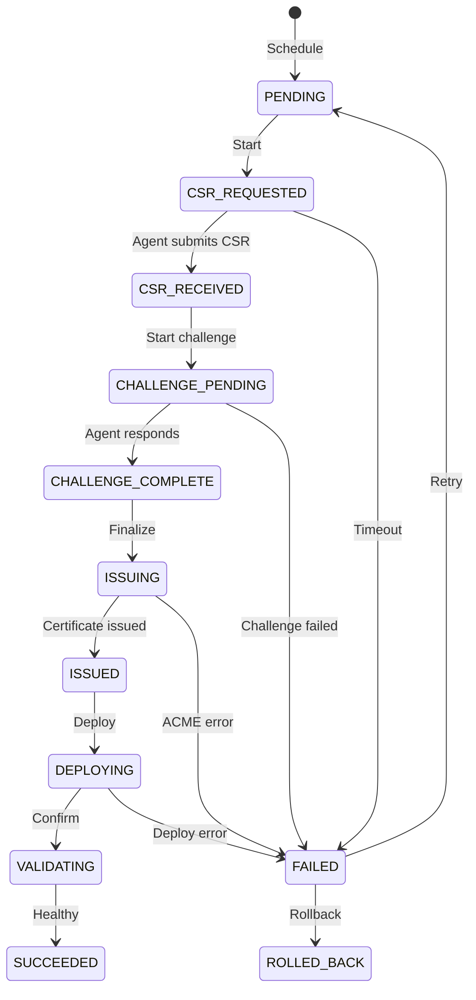

# Identity Renewals Runbook

## Overview

This runbook covers certificate renewal operations for the TensorGuard Machine Identity Guard subsystem.

## Prerequisites

- TensorGuard Platform running (`uvicorn tensorguard.platform.main:app`)
- Identity agent deployed on target fleet nodes
- ACME provider configured (Let's Encrypt, ZeroSSL, or Pebble for testing)

---

## Renewal Workflow



---

## Scheduled Renewal

### Automatic (Recommended)

Renewals are automatically scheduled when certificates enter the renewal window defined by policy.

```bash
# Check for certificates due for renewal
GET /api/v1/identity/inventory?expiry_within_days=30
```

### Manual Trigger

```bash
# Trigger immediate renewal
POST /api/v1/identity/renewals/run
{
    "endpoint_ids": ["endpoint-uuid"],
    "policy_id": "policy-uuid"
}
```

---

## Monitoring Renewals

### Check Job Status

```bash
# Get job status
GET /api/v1/identity/renewals/{job_id}

# List all jobs
GET /api/v1/identity/renewals?status=pending
```

### Status Meanings

| Status | Description | Action |
|--------|-------------|--------|
| `PENDING` | Waiting to start | None |
| `CSR_REQUESTED` | Waiting for agent | Check agent status |
| `CHALLENGE_PENDING` | ACME challenge in progress | Monitor challenge |
| `ISSUING` | Certificate being issued | Wait |
| `DEPLOYING` | Being deployed to endpoint | Monitor |
| `SUCCEEDED` | Complete | None |
| `FAILED` | Error occurred | See troubleshooting |

---

## Troubleshooting

### Agent Not Responding

1. Check agent heartbeat:
   ```bash
   GET /api/v1/identity/inventory
   # Look for agent last_heartbeat_at
   ```

2. Restart agent:
   ```bash
   # On agent node
   python -m tensorguard.identity.agent.main --fleet-id=XXX --api-key=XXX
   ```

### Challenge Failed

1. HTTP-01: Verify port 80 is accessible
2. DNS-01: Check TXT record propagation
3. Review audit log:
   ```bash
   GET /api/v1/identity/audit?action=challenge_started
   ```

### Deployment Failed

1. Check deployer logs on agent
2. Verify K8s permissions (if K8s endpoint)
3. Rollback if needed:
   ```bash
   POST /api/v1/identity/renewals/{job_id}/rollback
   {
       "reason": "Deployment verification failed"
   }
   ```

---

## Emergency Procedures

### Mass Certificate Expiry

1. Identify affected certificates:
   ```bash
   GET /api/v1/identity/inventory?expiry_within_days=7
   ```

2. Trigger batch renewal:
   ```bash
   POST /api/v1/identity/renewals/run
   {
       "endpoint_ids": ["id1", "id2", "id3"],
       "policy_id": "fastest-policy"
   }
   ```

3. Monitor with:
   ```bash
   GET /api/v1/identity/risk
   ```

### Rollback All Recent Renewals

```bash
# For each failed job
POST /api/v1/identity/renewals/{job_id}/rollback
{
    "reason": "Emergency rollback"
}
```

---

## Audit Verification

Verify audit chain integrity regularly:

```bash
GET /api/v1/identity/audit/verify

# Response:
{
    "is_valid": true,
    "total_entries": 150,
    "first_invalid_sequence": null
}
```

If `is_valid: false`, investigate immediately - indicates potential tampering.

---

## Policy Presets

| Preset | Max Validity | Renewal Window | Use Case |
|--------|--------------|----------------|----------|
| `47-day` | 47 days | 10 days | Mar 2029+ Chrome |
| `100-day` | 100 days | 20 days | Mar 2027+ |
| `200-day` | 200 days | 30 days | Mar 2026+ |
| `mtls` | 365 days | 30 days | Private CA client auth |
